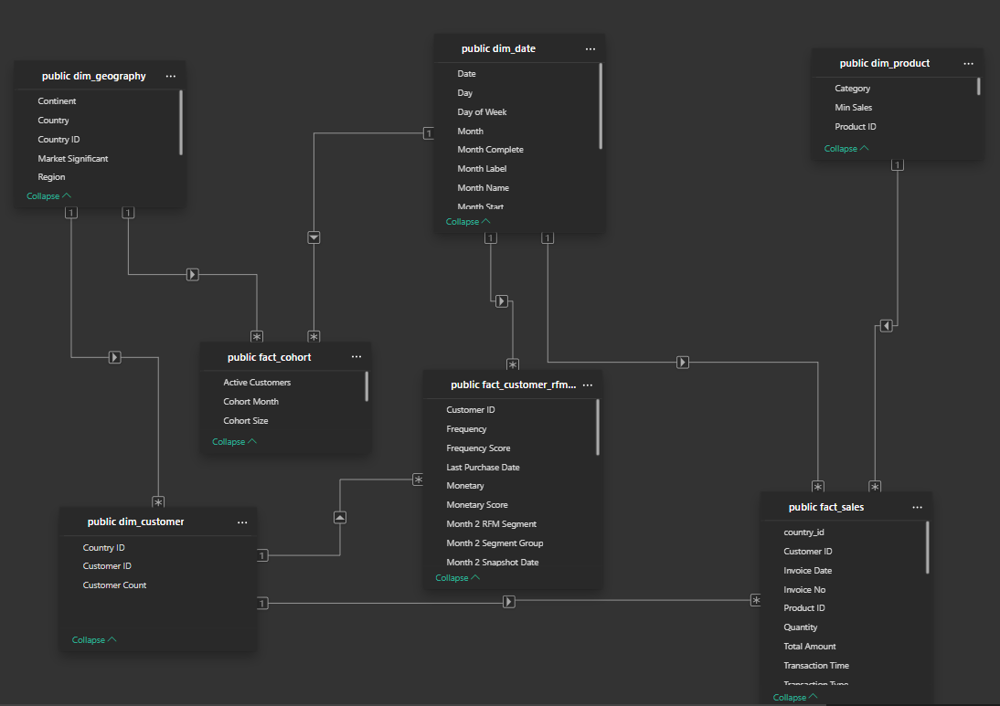
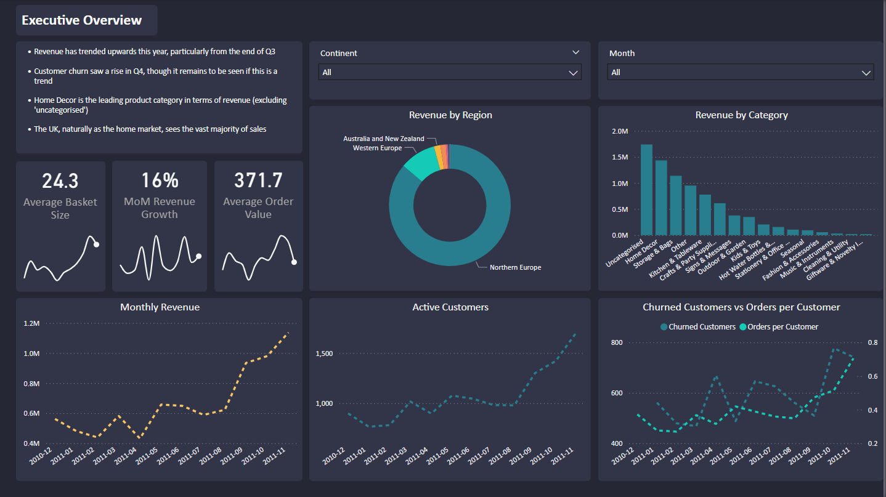
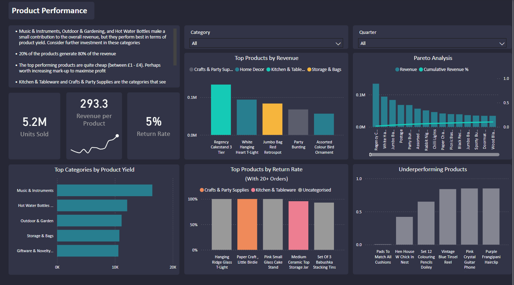
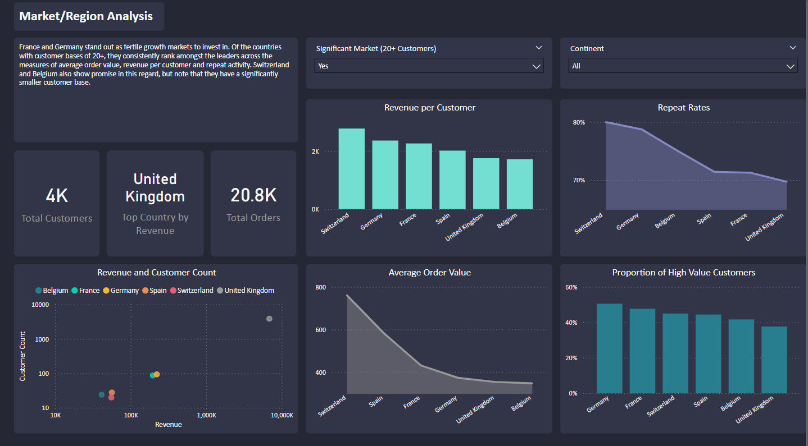
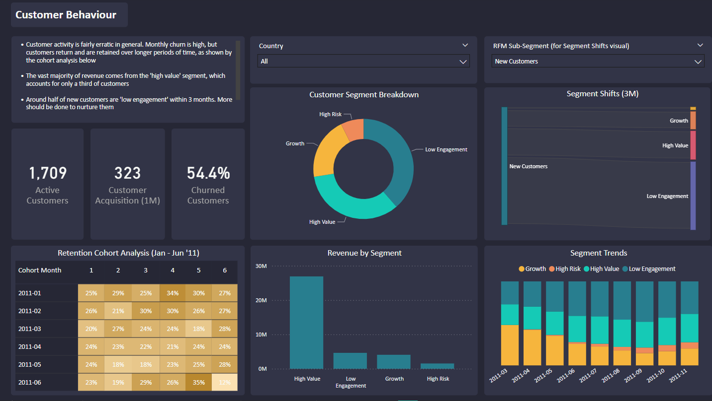
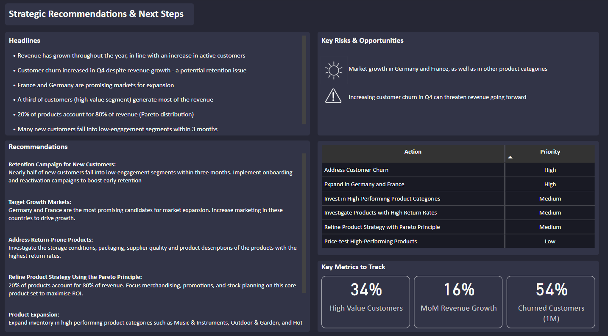

#  eCommerce Business Intelligence & Data Modelling Project

##  Project Overview

This project transformed **541,910 raw eCommerce transactions** from Kaggle into a **cleaned, dimensional data model** using **PostgreSQL** and surfaced strategic insights via an interactive **Power BI report**. The solution empowers business stakeholders to explore **product performance, customer retention**, and **regional growth opportunities**, helping guide **marketing, pricing, and inventory strategy**.

**Tech Stack:**  
SQL (PostgreSQL), Power BI, DAX, Excel, Dimensional Modelling, Git

---

##  Business Objectives

Key business questions answered:

- Which products and categories drive the most revenue and profit?

- Where are return rates highest — by product, category, and region — and what patterns emerge?

- What proportion of customers are high-value, at-risk, or low-engagement — and how do these segments evolve over time?

- Which countries or regions show the strongest growth potential and customer value?

- How do customer cohorts perform after acquisition — and when does churn tend to occur?

- What product categories are most profitable per unit sold?

- When are customers most likely to churn after their first purchase?

- How does customer behaviour differ by country or market size?

---

##  Data Modelling Approach

### Star Schema Design


Designed a **star schema** to support efficient querying and reporting:

- **Fact Tables**:  
  - `fact_sales`: Sales & returns  
  - `fact_customer_rfm_monthly`: Monthly RFM scores  
  - `fact_cohort`: Cohort behaviour and retention

- **Dimension Tables**:  
  - `dim_product`: Product details + manually created categories  
  - `dim_customer`: Customer IDs linked to country  
  - `dim_geography`: Country, region, continent metadata  
  - `dim_date`: Continuous calendar with flags for incomplete months



---

###  Data Cleaning & Preparation

- Removed non-customer rows (no CustomerID)
- Filtered invalid or unsellable product rows (zero/negative UnitPrice)
- Standardised product names for reliable aggregation
- Manually classified top products into categories (~80% of revenue)

---

##  Handling Returns

Returns logic was carefully implemented to prevent inflated return rates:

```sql
CASE 
  WHEN Quantity >= 0 THEN 'Sale' 
  ELSE 'Return' 
END AS transaction_type
```

Returns were validated only if the customer had sufficient prior purchases, ensuring reliable return rate analysis.

---

##  RFM Segmentation

Created a separate fact table for **monthly RFM scoring** with banded values for stability:

- `Recency`: Days since last purchase
- `Frequency`: Orders in the month
- `Monetary`: Monthly spend (based on fixed percentile bands)

Segments (e.g. *Champions*, *At Risk*, *Low Engagement*) were updated monthly and tracked using interval joins.

---

##  Geographic Mapping

Constructed `dim_geography` to support country-level cohort and customer analysis:

- One-to-many link between geography and customers
- Country flags for significant markets (≥20 customers)
- Includes region and continent data for rollups

---

##  Cohort Analysis

Built a cohort table to track **monthly retention by acquisition month**:

```sql
DATE_PART('month', AGE(activity_month, cohort_month)) +
DATE_PART('year', AGE(activity_month, cohort_month)) * 12 AS months_since_acquisition
```

Used for heatmaps and segment tracking in Power BI.

---

##  Power BI Report Summary

The report is divided into 5 key sections:

---

### 1. Executive Overview

- **Visuals**: Revenue trends, customer churn, category performance by region  
- **Insights**:  
  - Revenue growing since late Q3  
  - Churn rising in Q4  
  - UK dominates but may be saturated  
  - Home Decor leads in category revenue  



---

### 2. Product Performance

- **Visuals**: Units sold, return rate, revenue per product, category breakdown  
- **Insights**:  
  - 20% of products generate 80% of revenue  
  - Low-cost items dominate sales  
  - High return rates in Kitchen & Party Supplies  
  - Investment opportunity in Gardening & Music




---

### 3. Market / Region Analysis

- **Visuals**: AOV by country, repeat rate, revenue vs customer count  
- **Insights**:  
  - France and Germany show strong loyalty and spend  
  - Belgium & Switzerland promising despite smaller base  
  - UK well-established, less room for growth




---

### 4. Customer Behaviour

- **Visuals**: RFM segments, segment transitions, cohort heatmaps  
- **Insights**:  
  - High-value customers = 33% of revenue  
  - Half of new users churn within 3 months  
  - Signs of improving engagement, but churn risks rising




---

### 5. Summary & Next Steps

- **Visuals**: Headlines, recommendations, priority actions, key metrics (High Value Customers %, MoM Revenue Growth %, Churned Customers %)  
- **Insights**:  
  - Revenue grew steadily, but Q4 churn increased  
  - Germany and France are strong candidates for market expansion  
  - Top 20% of products drive 80% of revenue  
  - Many new customers disengage within 3 months  

- **Actions**:  
  - Launch onboarding and retention campaigns  
  - Prioritise core products and high-performing categories  
  - Expand in promising markets (France, Germany)  
  - Investigate high-return products and test price increases  




---

##  Key Deliverables

-  **Dimensional SQL Model**: Robust schema supporting advanced BI
-  **Power BI Report**: 5-page, interactive report with actionable insights
-  **RFM & Cohort Logic**: Monthly scoring + retention tracking
-  **Business Recommendations**: Data-driven suggestions for product, market, and retention strategy

---

##  Key Strategic Insights

- Focus retention efforts on Q4 churners and new users
- Prioritise France and Germany for international growth
- Reconsider product mix in categories with high return rates
- Segment VIPs for upsell or loyalty programmes

---

##  Files & Access

- [SQL Transformation Logic](bi_sql_transformation_logic.md) – Data transformation & modelling queries  
- [Power BI Report (.pbix)](eCommerce_BI_Report.pbix) – Interactive report  
- [Project Summary (.pdf)](project_summary.pdf) – One-pager for recruiters or clients  
- [Data Limitations](data_limitations.md) – Notes on data quality and limitations  
- [DAX Measures](dax_measures.md) – DAX Measures used across the BI report  

---
